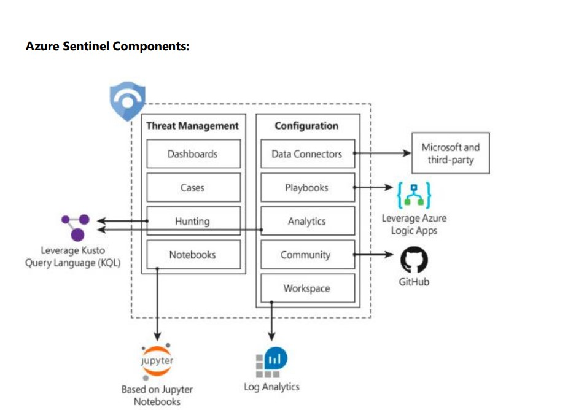

Alert Source SOPs
=================

Sentinel
----------

Microsoft Sentinel is a cloud-native security information and event manager (SIEM) platform that uses built-in AI to help analyse large volumes of data across an enterprise—fast

Background - Why Kusto Query Language?
Microsoft Sentinel is built on top of the Azure Monitor service and it uses Azure Monitor’s Log Analytics workspaces to store all of its data. This data includes any of the following:

data ingested from external sources into predefined tables using Microsoft Sentinel data connectors.
data ingested from external sources into user-defined custom tables, using custom-created data connectors as well as some types of out-of-the-box connectors.
data created by Microsoft Sentinel itself, resulting from the analyses it creates and performs - for example, alerts, incidents, and UEBA-related information.
data uploaded to Microsoft Sentinel to assist with detection and analysis - for example, threat intelligence feeds and watchlists.
Kusto Query Language was developed as part of the Azure Data Explorer service, and it’s therefore optimized for searching through big-data stores in a cloud environment. Inspired by famed undersea explorer Jacques Cousteau (and pronounced accordingly "koo-STOH"), it’s designed to help you dive deep into your oceans of data and explore their hidden treasures.

Kusto Query Language is also used in Azure Monitor (and therefore in Microsoft Sentinel), including some additional Azure Monitor features, which allow you to retrieve, visualize, analyze, and parse data in Log Analytics data stores. In Microsoft Sentinel, you're using tools based on Kusto Query Language whenever you’re visualizing and analyzing data and hunting for threats, whether in existing rules and workbooks, or in building your own.

Because Kusto Query Language is a part of nearly everything you do in `Microsoft Sentinel`, a clear understanding of how it works helps you get that much more out of your SIEM.

You want to learn more
click on this link 
'https://techcommunity.microsoft.com/t5/microsoft-sentinel-blog/become-a-microsoft-sentinel-ninja-the-complete-level-400/ba-p/1246310'

Console View
--------------

.. image:: sent.jpg

Azure Sentinel Components
--------------------------

AWS Guard duty 
---------------